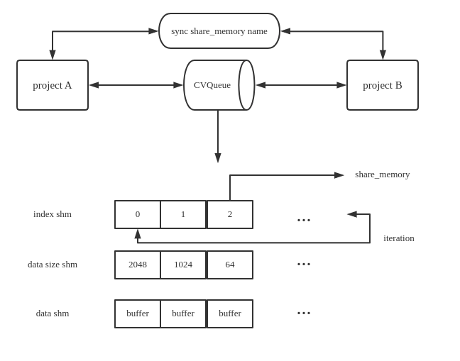

### CV Image

Human-like API to unite different image format, convenient way to convert/show/save one pic or even pic path.

Makes `BGR RGB PIL cv2 sk-image bytes base64 tensor` to be one **CVImage**.

#### example

```python
from cv2box import CVImage
img_in = 'img path' # or img_in = cv2.imread('img path')
img_bgr = CVImage(img_in).bgr
img_rgb = CVImage(img_in).rgb
img_pil = CVImage(img_in).pillow
img_base64 = CVImage(img_in).base64
img_bytes = CVImage(img_in).bytes

# show image using opencv
CVImage(img_in).resize(256,256).show()

# save image using opencv
from PIL import Image
img_in_pillow = Image.open('image path')
CVImage(img_in_pillow, image_format='pillow').resize(256,256).save('image save path')

# image2tensor
trans = {}
CVImage(img_in).set_transform(trans).tensor.cuda()
# image2cvblob
onnx_input = CVImage(img_in).set_blob(127.5,127.5,(112,112)).blob_rgb

```

### CV Queue

A queue-like high-level class which can be used for two different python projects on same host machine.

Based on ShareMemory , which is more efficient than socket or grpc.

#### idea



#### fixed problems

- Deal with memory release;
- Sync without lock;
- Multi size buffer trans;
- Add queue-like api like full/empty/close;
- Mem access delay to avoid access fail;
- More retry logic;

#### cam stream example

```python
import cv2
from cv2box import CVQueue, CVImage

# project A
cvq = CVQueue(10, mem_name='cv2box', max_data_size=3*1920*1080)
cap = cv2.VideoCapture(0)
while True:
    _, frame = cap.read()
    img_buffer = CVImage(frame).format_bytes
    cvq.push(img_buffer)
    
# project B
get_cvq = CVQueue(10, mem_name='cv2box')
while True:
    get_buf, get_buffer_len = get_cvq.get()
    image_to_show = bytes(get_buf.buf[:get_buffer_len])
    get_q.get_ok()
    frame_get = CVImage(image_to_show, image_format='buffer',image_size=(frame_height, frame_width, 3)).bgr
    CVImage(frame_get).show()
```

### CV File

Support pickle/txt/json/yaml etc. (todo)

#### example

```python
from cv2box import CVFile
pkl = './test.pkl'
print(CVFile(pkl).data)
```

### CV Excel

basic ops for insert data to excel file.

### CV Video

TODO